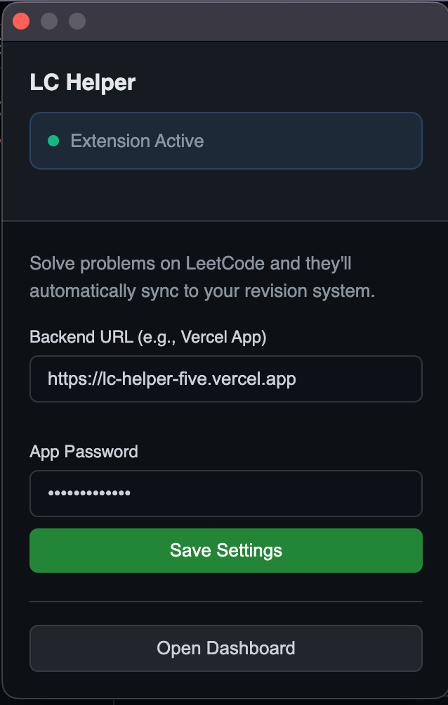
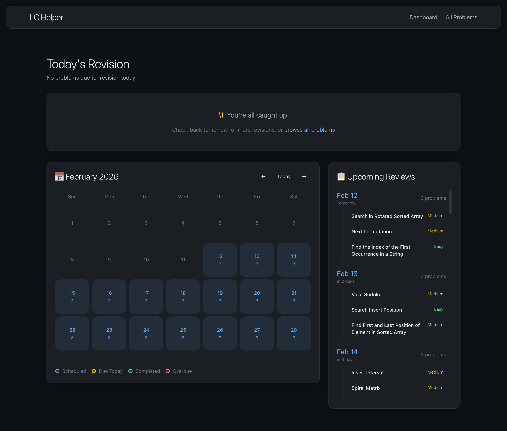
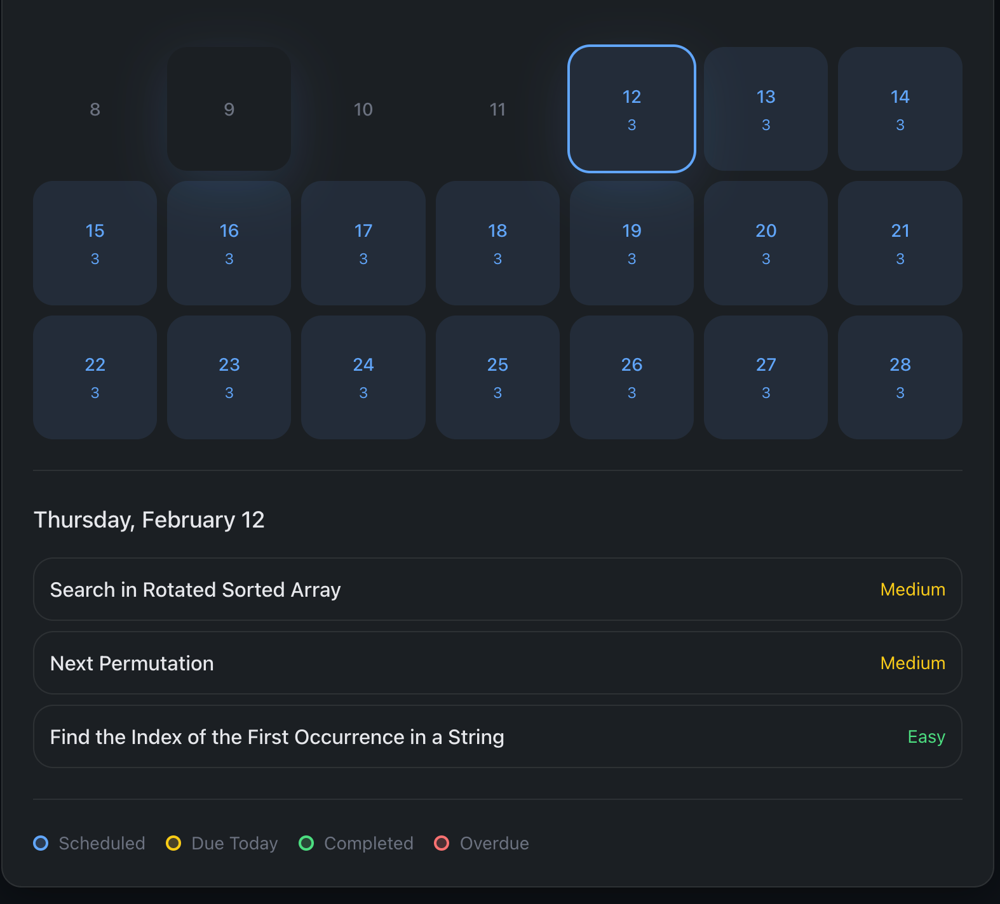
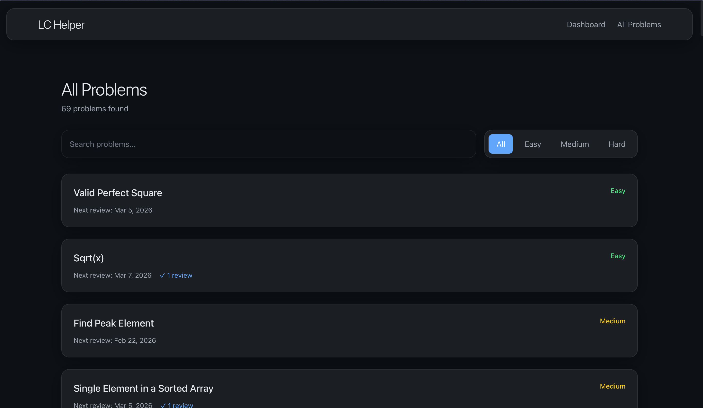
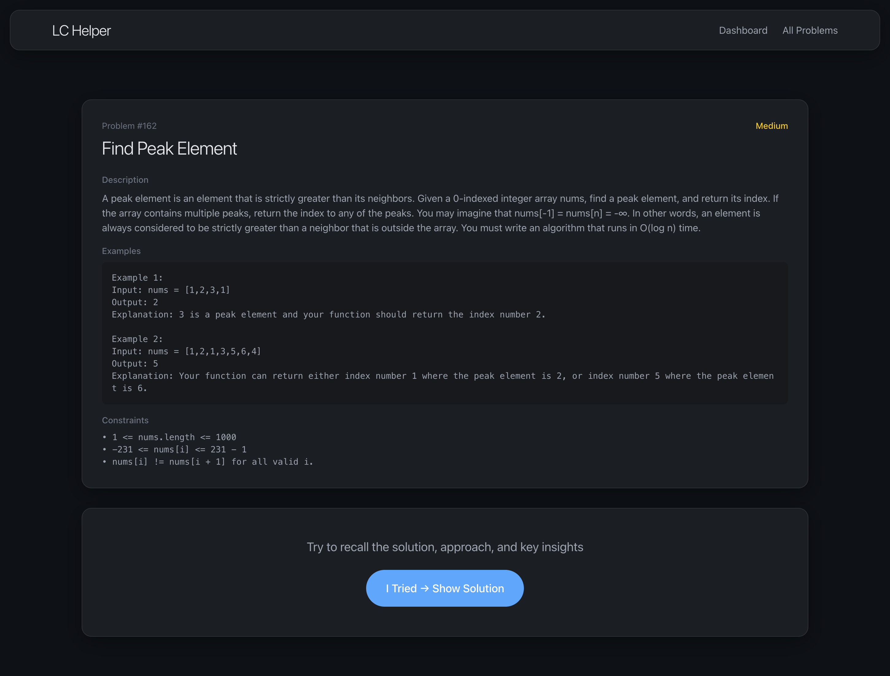
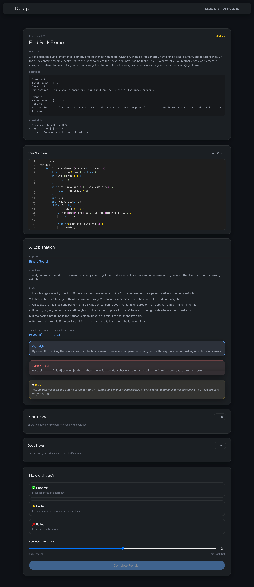

# LC Helper

**Your Personal LeetCode Second Brain**

LC Helper is a privacy-focused, recall-first revision system designed to ensure you never forget an algorithm you have solved. It combines automated capture via a browser extension, strict AI explanations using Google Gemini, and a smart spaced repetition algorithm into a premium, distraction-free dashboard.

---

## Features

### 1. Zero-Friction Capture
- **Browser Extension**: Automatically detects when you submit an *Accepted* solution on LeetCode.
- **Smart Sync**: Instantly captures your code, problem details, constraints, and complexity analysis.
- **Resilient Design**: Works directly with the DOM, making it independent of LeetCode's official API changes.

### 2. Strict AI Explanations
- **Powered by Google Gemini**: The AI reads *your specific code* to explain the logic.
- **Educational Focus**: It strictly avoids generating new code or suggesting "better" solutions, focusing instead on the Core Idea, Key Insights, and Common Pitfalls to build long-term understanding.

### 3. Smart Revision System
- **Daily Review Cap**: Limits you to **3 problems per day** to prevent burnout.
- **Spaced Repetition**: Uses a scientifically backed schedule (2, 3, 7, 21, 60 days) to maximize retention.
- **Active Recall**: The UI hides the solution until you have mentally reconstructed the approach.
- **Early Revision Handling**: Reviewing a problem early automatically frees up its future slot, allowing you to manage your schedule flexibly.

### 4. Interactive Dashboard
- **Live Search**: Instantly filter problems by title, difficulty, or key concepts.
- **Calendar View**: Visualize your revision consistency with a contribution-style activity grid.
- **Upcoming Tasks**: A sorted list of what revision work is coming up in the next few days.

---

## Tech Stack

- **Framework**: Next.js 14 (App Router)
- **Database**: PostgreSQL (via Supabase) with Prisma ORM
- **Styling**: Tailwind CSS (Premium Glassmorphism Design)
- **AI**: Google Gemini API
- **Deployment**: Vercel
- **Browser**: Chrome Extension Manifest V3

---

## Self-Hosting Guide

Follow these steps to deploy your own instance of LC Helper.

### Prerequisites
1.  **GitHub Account**: To fork the repository.
2.  **Vercel Account**: For hosting the application.
3.  **Supabase Account**: For the hosted PostgreSQL database.
4.  **Google Gemini API Key**: Get one for free from Google AI Studio.

### Step 1: Database Setup (Supabase)
1.  Create a new project on Supabase.
2.  Go to **Project Settings** -> **Database**.
3.  Copy the **Connection String (URI)**.
    *   You will need two versions: the Transaction Pooler connection (usually port 6543) and the Session/Direct connection (usually port 5432).

### Step 2: Deploy to Vercel
1.  Fork this repository to your GitHub account.
2.  Log in to Vercel and click **"Add New"** -> **"Project"**.
3.  Import your forked repository.
4.  In the **Environment Variables** section, add the following:

    | Variable Key | Description |
    | :--- | :--- |
    | `DATABASE_URL` | The Transaction Pooler connection string from Supabase. |
    | `DIRECT_URL` | The Direct connection string from Supabase. |
    | `GEMINI_API_KEY` | Your Google Gemini API Key. |
    | `APP_PASSWORD` | A strong password to protect your data (e.g., `my-secret-pass-123`). |

5.  Click **Deploy**.

### Step 3: Initialize Database
Once deployed, you need to push the schema to your Supabase database. You can do this from your local machine:

1.  Clone your fork locally:
    ```bash
    git clone https://github.com/yourusername/lc-helper.git
    cd lc-helper
    npm install
    ```
2.  Create a `.env` file locally with the *same* `DATABASE_URL` and `DIRECT_URL` you used on Vercel.
3.  Run the migration:
    ```bash
    npx prisma db push
    ```

### Step 4: Configure the Extension
1.  Go to `chrome://extensions/` in your browser.
2.  Enable **Developer mode** (top right).
3.  Click **Load unpacked** and select the `extension` folder from this repository.
4.  Click the LC Helper extension icon in your toolbar.
5.  **Configure Settings**:
    *   **Backend URL**: Enter your Vercel URL (e.g., `https://your-project.vercel.app`).
    *   **App Password**: Enter the `APP_PASSWORD` you set in Vercel.
6.  Click **Save**.

---

## Usage

1.  **Solve**: Go to LeetCode and solve a problem. When you see the "Accepted" screen, the extension will sync the result to your Vercel app.
2.  **Review**: Open your Vercel app URL. You will see due problems for the day.
3.  **Learn**: Click a problem to reveal the AI explanation and your captured code. Rate your recall (Success/Partial/Fail) to schedule the next review.

---

## Demo







---

## License

MIT License

Copyright (c) 2026

Permission is hereby granted, free of charge, to any person obtaining a copy
of this software and associated documentation files (the "Software"), to deal
in the Software without restriction, including without limitation the rights
to use, copy, modify, merge, publish, distribute, sublicense, and/or sell
copies of the Software, and to permit persons to whom the Software is
furnished to do so, subject to the following conditions:

The above copyright notice and this permission notice shall be included in all
copies or substantial portions of the Software.

THE SOFTWARE IS PROVIDED "AS IS", WITHOUT WARRANTY OF ANY KIND, EXPRESS OR
IMPLIED, INCLUDING BUT NOT LIMITED TO THE WARRANTIES OF MERCHANTABILITY,
FITNESS FOR A PARTICULAR PURPOSE AND NONINFRINGEMENT. IN NO EVENT SHALL THE
AUTHORS OR COPYRIGHT HOLDERS BE LIABLE FOR ANY CLAIM, DAMAGES OR OTHER
LIABILITY, WHETHER IN AN ACTION OF CONTRACT, TORT OR OTHERWISE, ARISING FROM,
OUT OF OR IN CONNECTION WITH THE SOFTWARE OR THE USE OR OTHER DEALINGS IN THE
SOFTWARE.
